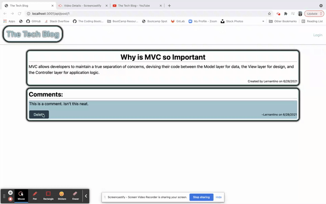
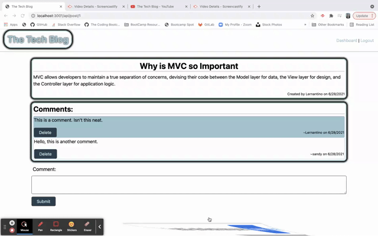

# MVC - The Tech Blog

## Table of Contents
* [Description](#description)
* [Lessons Learned](#lessons-learned)
* [Usage](#usage)
* [Tools](#tools)
* [How to Contribute](#how-to-contribute)
* [License](#license)
* [Questions](#questions)
## Description 
This application is a CMS style blog site where users can publish posts or comment existing posts from other users. It utilizes the MVC method through Sequelize, Handlebars, Express, and Express-Session. 
This application provides an easy to use and simple platform for sharing stories, discoveries and general information about tech.

## Lessons Learned
Building this application proved to be very challenging. It involved furthering my knowledge of associations and relations in sequelize, developing various api routes, using CRUD to pass user inputs front the browser to the MySQL database, and finally accessing data from the database to display via rendered handlbar templates. A surprise I encountered was the refresher on fron-end javascript and how that interfaced with the controller routes in the MVC framework. 
## Usage
This application is currently deployed on Heroku, so just follow the link and have fun!
 
  ### Demo
  Below if a video of the full functionality of the application. To visit the homepage, the user would click on the "The Tech Blog" header. When not logged in, the user can select a blog post, and view the post as well as comments. To login, the user would select "login" in the nav bar. Once logged in, the user can manage their posts through the dashboard, and can manage comments when on the post page.

  

  If the user if not logged in, there are limitations on adding and deleting comments:

  

  If the user is logged in, they can only delete comments that they have created:

  

  Here is the deployed link:
## Tools
                              

## How to Contribute
If you would like to contribute, please follow the relevant steps outlined here: https://www.dataschool.io/how-to-contribute-on-github/ or send feedback to Sandy Marr.

## License

Copyright 2021 Sandra Marr

  Permission is hereby granted, free of charge, to any person obtaining a copy of this software and associated documentation files (the "Software"), to deal in the Software without restriction, including without limitation the rights to use, copy, modify, merge, publish, distribute, sublicense, and/or sell copies of the Software, and to permit persons to whom the Software is furnished to do so, subject to the following conditions:
  
  The above copyright notice and this permission notice shall be included in all copies or substantial portions of the Software.
  
  THE SOFTWARE IS PROVIDED "AS IS", WITHOUT WARRANTY OF ANY KIND, EXPRESS OR IMPLIED, INCLUDING BUT NOT LIMITED TO THE WARRANTIES OF MERCHANTABILITY, FITNESS FOR A PARTICULAR PURPOSE AND NONINFRINGEMENT. IN NO EVENT SHALL THE AUTHORS OR COPYRIGHT HOLDERS BE LIABLE FOR ANY CLAIM, DAMAGES OR OTHER LIABILITY, WHETHER IN AN ACTION OF CONTRACT, TORT OR OTHERWISE, ARISING FROM, OUT OF OR IN CONNECTION WITH THE SOFTWARE OR THE USE OR OTHER DEALINGS IN THE SOFTWARE.

## Questions

For any questions, please contact Sandra Marr: [GitHub](https://github.com/sandra-marr) or [Email](srpeters44@gmail.com)